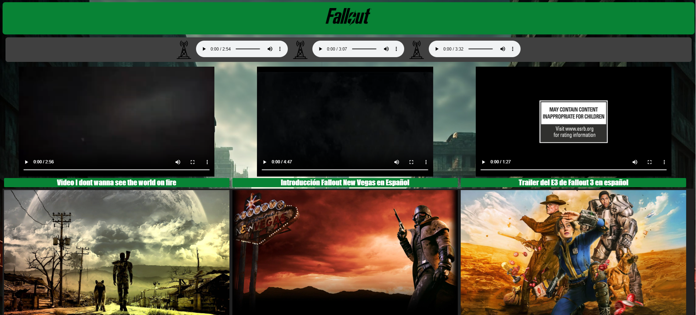
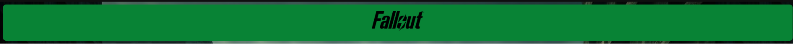
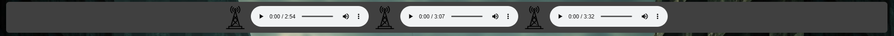
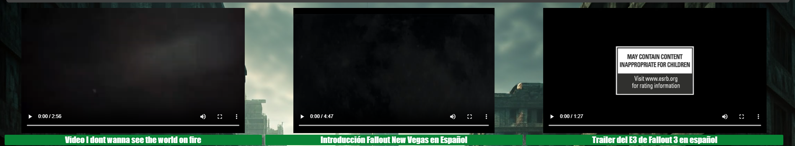
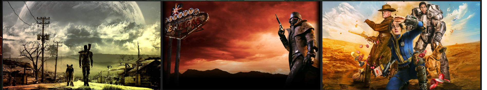

# Documentación Fallout

1. Para empezar esta sería la página sobre la que vamos a documentar. En ella he puesto un background diseñado por ia con temática de dicha serie de videojuegos

2. Empezaremos por hablar por el encabezado, he hecho un encabezado con fondo verde y bordes redondeados sobre el cual he puesto el logotipo de la saga

3. El navegador que he usado en la parte superior no tiene mucha función excepto para reproducir diferentes audios sacados de las radios de los videojuegos

4. Acto seguido he integrado 3 videos dentro del mismo apartado con los trailers de los diferentes video juegos

5. A continuación y para terminar he integrado una serie de imagenes sobre los juegos y la reciente serie, cada una de ellas funciona como un enlace para visualizar más información acerca de lo que se esta pudiendo ver en las imágenes.

